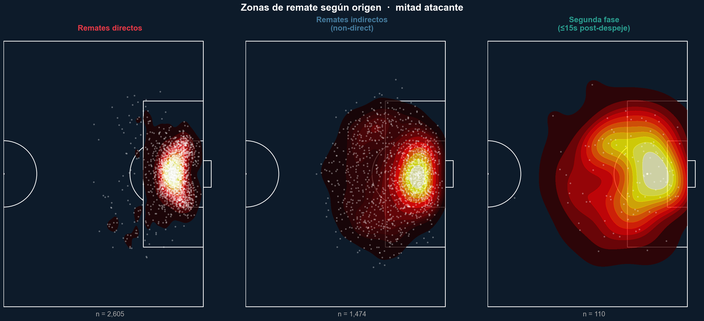

# Liga MX Corner Analysis

Análisis de tiros de esquina en Liga MX usando StatsBomb 360 data - 8 torneos · 2021/22 – 2024/25 · 13 279 córneres.

## Objetivo

Convertir los córneres en recomendaciones tácticas accionables: qué tipo de envío (inswinging / outswinging / corto / straight) maximiza OBV y xG, cómo varía por equipo y temporada, y qué configuraciones generan más riesgo de contraataque.

## Estructura del proyecto

```
proyecto/
├── data/
│   ├── raw/                        # StatsBomb originales (no versionados)
│   │   ├── events.parquet          # 4 445 130 eventos · 142 cols
│   │   ├── matches.parquet         # 1 364 partidos
│   │   ├── comps.parquet           # 8 torneos
│   │   └── lineups.json
│   └── processed/                  # Generados por 01_preprocessing (no versionados)
│       ├── corners.parquet              # 13 279 filas - envío inicial
│       ├── from_corner.parquet          # 124 740 filas - posesiones From Corner
│       ├── from_corner_enriched.parquet # 124 740 × 153 cols - eventos + contexto padre
│       ├── shots_from_corner.parquet    # 5 607 remates en posesión directa
│       ├── shots_second_phase.parquet   # 110 remates ≤15s post-despeje
│       └── corner_features.parquet      # 13 279 × 60 - dataset maestro (1 fila/córner)
├── notebooks/
│   ├── 01_preprocessing.ipynb      # Carga raw → construye todos los datasets procesados
│   ├── 02_eda.ipynb                # EDA: mix táctico, pitch maps, freeze frame 360
│   ├── 03_modeling.ipynb           # OBV, xG, Random Forest + SHAP
│   └── 04_recommendations.ipynb   # Simulación de cambio de mix y recomendaciones
├── figures/                        # Gráficas generadas por los notebooks
├── specs/                          # Documentación StatsBomb y brief ISAC
├── requirements.txt
└── README.md
```

## Setup

```bash
pip install -r requirements.txt
```

Orden de ejecución:

```bash
jupyter lab notebooks/01_preprocessing.ipynb   # corre una vez, genera data/processed/
jupyter lab notebooks/02_eda.ipynb
jupyter lab notebooks/03_modeling.ipynb
jupyter lab notebooks/04_recommendations.ipynb
```

Los notebooks `02`–`04` cargan directo desde `data/processed/` y no requieren re-procesar los 4.4M eventos.

## Datasets clave

| Dataset | Filas | Descripción |
|---|---|---|
| `corner_features` | 13 279 × 60 | Una fila por córner - OBV, xG, tipo, lado, outcome, contexto 360 |
| `from_corner_enriched` | 124 740 × 153 | Eventos de la secuencia con contexto del córner padre |
| `shots_from_corner` | 5 607 | Remates en posesión directa, con freeze frame 360 |
| `shots_second_phase` | 110 | Remates post-despeje, linkados al córner original |

## Hallazgos preliminares

**Preprocessing**
- 13 279 córneres en 1 364 partidos · 8 torneos · cobertura 360 del 64.8% en envíos
- Mix global: Outswinging 42% · Inswinging 35% · Short 20% · Straight 3%
- Tasa de remate en posesión directa: **37.8%** · tasa de contraataque: ~2.5%
- 110 remates de segunda fase (≤15s post-despeje) linkados al córner original via `corner_id`
- `pass_cross` y `pass_cut_back` son 100% null en córneres: StatsBomb no etiqueta córneres como crosses
- `cluster_label` (60 clusters de pase) también es null para córneres - campo solo aplica a pases de juego abierto

**EDA**
- Inswinging siempre usa pie dominante (contrario al banderín); Outswinging siempre pie cruzado - correlación perfecta que valida la consistencia del dataset
- Outswinging tiene mayor tasa de remate (42.4%) que Inswinging (34.1%), pero OBV medio más bajo
- Zona de destino: Inswinging concentra en primer palo · Outswinging dispersa hacia segundo palo y zona penal · Short llega corto y disperso
- Los remates directos de córner se concentran en el área chica (6-yard box); segunda fase lo hace en el punto de penalti




## Datos

Los archivos en `data/` no están versionados por tamaño.  
Fuente: StatsBomb 360 / HUDL API - Liga MX 2021/22–2024/25.
