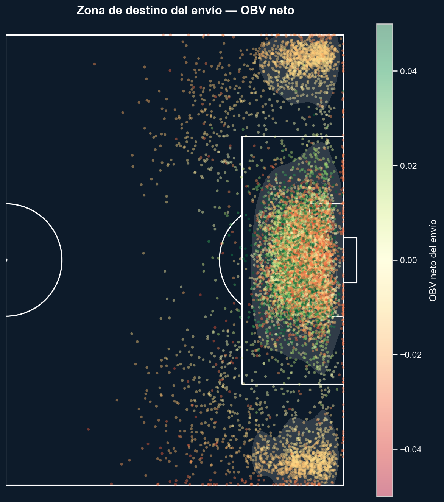
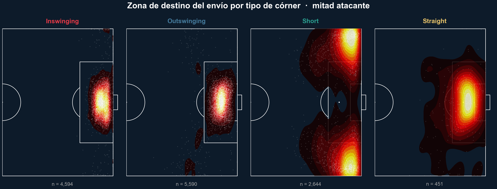
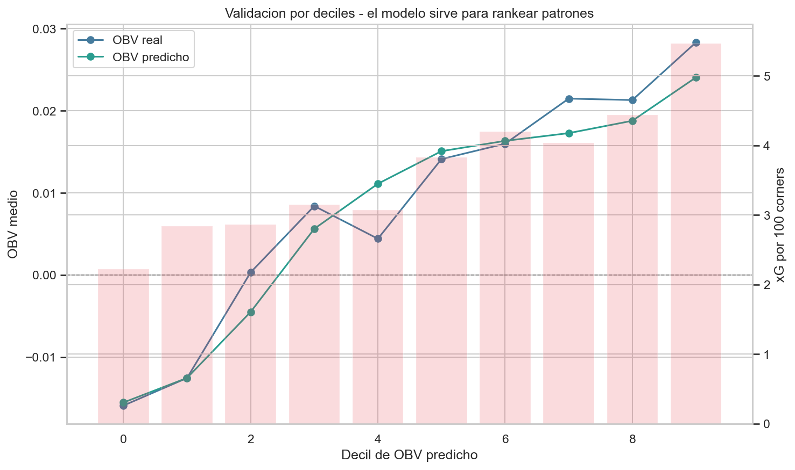

# Liga MX Corner Analysis

Análisis de tiros de esquina en Liga MX con datos StatsBomb 360.

El proyecto cubre 8 torneos, de 2021/22 a 2024/25, con 13,279 córneres. El objetivo no es predecir un córner individual con alta precisión, sino convertir los datos en recomendaciones tácticas accionables: qué zonas de envío priorizar, qué tipos de córner sostienen más valor y qué equipos tienen más margen de mejora.

## Objetivo

Evaluar el valor táctico de los córneres considerando:

- Volumen de remates generados.
- Calidad de la ocasión (`seq_sum_xg`).
- Valor del envío (`obv_total_net`).
- Riesgo de contraataque (`led_to_counter`).
- Retención de posesión y segunda fase.

El análisis evita reducir la pregunta a "¿hubo remate?". Un córner puede ser valioso aunque no termine inmediatamente en disparo, y también puede ser costoso si deja al equipo expuesto.

## Estructura del proyecto

```text
proyecto/
├── data/
│   ├── raw/                        # StatsBomb originales, no versionados
│   │   ├── events.parquet          # 4,445,130 eventos
│   │   ├── matches.parquet         # 1,364 partidos
│   │   ├── comps.parquet           # 8 torneos
│   │   └── lineups.json
│   └── processed/                  # Generados por 01_preprocessing
│       ├── corners.parquet              # 13,279 córneres
│       ├── from_corner.parquet          # 124,740 eventos From Corner
│       ├── from_corner_enriched.parquet # Eventos + contexto del córner padre
│       ├── shots_from_corner.parquet    # 5,607 remates directos
│       ├── shots_second_phase.parquet   # 110 remates de segunda fase
│       └── corner_features.parquet      # Dataset maestro, 1 fila por córner
├── notebooks/
│   ├── 01_preprocessing.ipynb      # Limpieza, filtros y datasets procesados
│   ├── 02_eda.ipynb                # EDA, mix táctico, zonas y contexto 360
│   ├── 03_modeling.ipynb           # Efectividad, análisis espacial y modelo ML
│   └── 04_recommendations.ipynb    # Scorecard, simulación y recomendación final
├── figures/                        # Figuras exportadas por los notebooks
├── specs/                          # Specs StatsBomb y brief del reto
├── requirements.txt
├── CLAUDE.md
└── README.md
```

## Setup

```bash
pip install -r requirements.txt
```

Orden recomendado de ejecución:

```bash
jupyter lab notebooks/01_preprocessing.ipynb
jupyter lab notebooks/02_eda.ipynb
jupyter lab notebooks/03_modeling.ipynb
jupyter lab notebooks/04_recommendations.ipynb
```

Los notebooks `02` a `04` cargan desde `data/processed/`; no necesitan volver a procesar los 4.4M eventos si `01_preprocessing.ipynb` ya fue ejecutado.

## Datasets clave

| Dataset | Tamaño | Uso |
|---|---:|---|
| `corner_features.parquet` | 13,279 x 60 | Dataset maestro: tipo, lado, destino, OBV, xG, outcome y contexto 360 |
| `from_corner_enriched.parquet` | 124,740 x 153 | Secuencias completas con contexto del córner original |
| `shots_from_corner.parquet` | 5,607 filas | Remates en posesión directa desde córner |
| `shots_second_phase.parquet` | 110 filas | Remates tras despeje, dentro de 15 segundos |

## Notebooks

### 01 · Preprocessing

- Define el marco técnico: coordenadas StatsBomb, OBV, tipos de envío, clusters y eventos relevantes.
- Filtra córneres y secuencias `From Corner`.
- Construye `corner_features`, el dataset maestro de una fila por córner.
- Enriquece eventos de secuencia con contexto del córner padre.

### 02 · EDA

- Explora distribución por torneo, etapa, equipo, tipo y lado.
- Analiza mix táctico: Outswinging, Inswinging, Short y Straight.
- Visualiza zonas de destino, zonas de remate y freeze frames 360.
- Compara efectividad por equipo y franja temporal.

### 03 · Modeling

- Evalúa efectividad con OBV, xG, tasa de remate, contraataque y primera acción post-envío.
- Entrena un modelo ML sencillo para estimar `obv_total_net` del envío.
- Usa validación temporal: entrenamiento 2021/22-2023/24 y prueba 2024/25.
- El modelo principal es un `RandomForestRegressor` pequeño e interpretable; sirve para rankear patrones, no para prometer precisión por córner individual.

### 04 · Recommendations

- Convierte el análisis en una recomendación táctica para staff técnico.
- Construye scorecards por tipo y zona de destino.
- Simula mover 20% de envíos de bajo valor hacia zonas centrales.
- Prioriza recomendaciones por equipo según oportunidad estimada y perfil actual.

## Hallazgos principales

- Mix global: Outswinging 42.1%, Inswinging 34.6%, Short 19.9%, Straight 3.4%.
- La tasa global de remate directo es 37.8%, pero el remate por sí solo no captura calidad ni riesgo.
- Inswinging tiene mayor OBV medio que Outswinging; Outswinging genera más volumen de remates.
- Short conserva más posesión, pero su valor medio y xG por córner son menores; funciona mejor como variante situacional que como base.
- Los envíos a `central_box` son el patrón más estable: OBV medio positivo, mayor xG por 100 córneres y buena tasa de remate.
- Las zonas `edge_or_short` y `recycled` concentran menor valor observado y son el foco natural de mejora.
- El riesgo de contraataque es bajo en términos absolutos, por lo que no debe dominar la decisión salvo contra rivales específicos.
- La mayor limitación del proyecto es que faltan variables tácticas de alto valor: marcador, estructura defensiva, carreras, marcaje y plan específico del rival.

## Modelo

El modelo de `03_modeling.ipynb` predice `obv_total_net` con variables disponibles al nivel del envío: tipo, lado, altura, cuerpo, longitud, ángulo, destino, minuto, periodo, semana y contexto 360 cuando existe.

Resultado en test temporal 2024/25:

| Modelo | MAE | RMSE | R2 | Spearman |
|---|---:|---:|---:|---:|
| Baseline media | 0.0355 | 0.0553 | -0.0002 | - |
| Random Forest OBV | 0.0313 | 0.0535 | 0.0662 | 0.194 |

La señal es limitada pero útil para ordenar patrones. En deciles de predicción, los grupos con mayor OBV predicho también muestran más OBV real y más xG por 100 córneres.

## Recomendación final

La recomendación principal es mover volumen desde envíos de bajo valor (`edge_or_short`, `recycled`) hacia zonas centrales del área, especialmente `central_box`, sin eliminar la variación táctica.

Guía práctica:

- Priorizar envíos a zonas centrales y cercanas al área chica.
- Mantener Outswinging cuando se busque volumen de remates.
- Usar Inswinging cuando se busque mayor valor medio del envío.
- Usar Short como variante situacional, no como estrategia principal.
- Trabajar segunda fase y rechaces, porque muchos córneres valiosos no terminan en el primer contacto.

## Figuras destacadas








## Datos

Los archivos en `data/` no están pensados para versionarse por tamaño.

Fuente: StatsBomb 360 / HUDL API, Liga MX 2021/22-2024/25.
